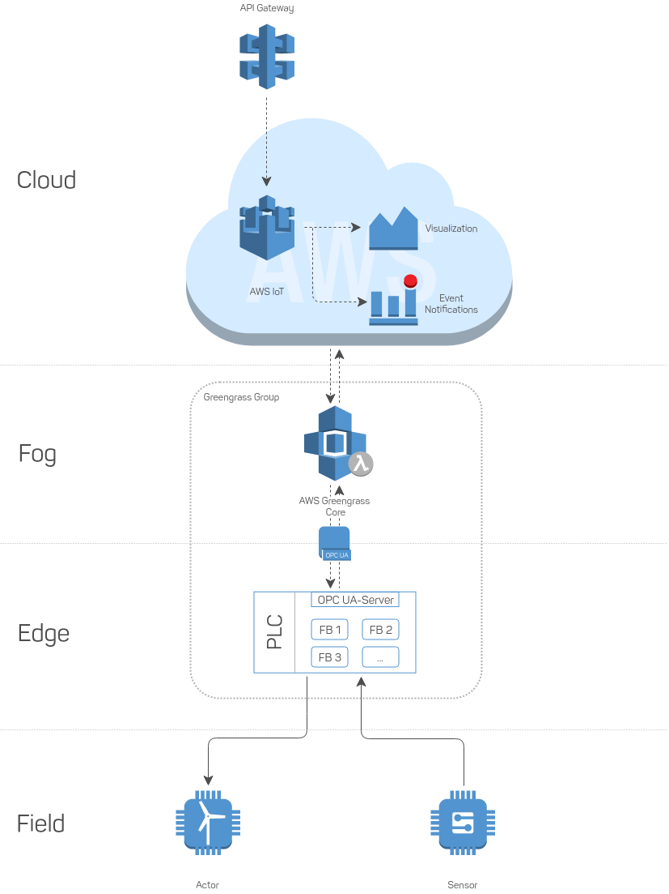

# Serverless system integration on an industrial level

This case study aims to demonstrate the advantages of modern architectural
approaches in the field of IoT and I4.0. It is designed to serve as an example
for how a "classical" solely PLC-based control can be substituted by a in a
serverless, decentralized context. An industrial plant w/ an OPC UA interface is
connected to AWS IoT using AWS Greengrass on fog layer for redundancy. The
process logic - originally implemented solely onto a single PLC - is decentralized
and split upbetween the cloud and the edge (PLC / OPC UA) level.

The schematic architecture can be seen in the below illustration:

The project can be divided in three parts:

1. Setting up an OPC UA-server as an interface to the machinery
2. Setting up an AWS Greengrass instance on fog-level
3. Implementing the process logic
